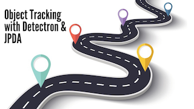

# Multi Object Tracking 
This project is written in C++ (Qt Framework). 
The most important Algorithm for State Estimation is "Kalman Filter" and its variations, but "kalman Filter" has weakness in an Environment with Clutter and Missdetection. 
So for this type of environment there are other Algorithms like GNN, JPDA and PMBM for object Tracking.

I've started this project to implement GNN, JPDA and PMBM in C++ Language. The main reason that I chose C++ is that it is more efficient than other languages like Python.

At the moment I've implemented PDA (Probabilistic Data Association) Algorithm and I'm working on other Algorithms as well.

This project is a console application, and it uses TCP to communicate to other application named "Embedded Software Interface".
For more Details you can see these two Youtube videos:

### Embedded Software Interface
I've implemented this project as the main interface for most of my projects, you can see its source code via this link:
[Embedded Software Interface](https://github.com/Afshari/Embedded_App_Interface)

### TODO: 
~~~
1. Complete JPDA Algorithm
2. Add GNN Algorithm
3. Add PMBM Algorithm
~~~